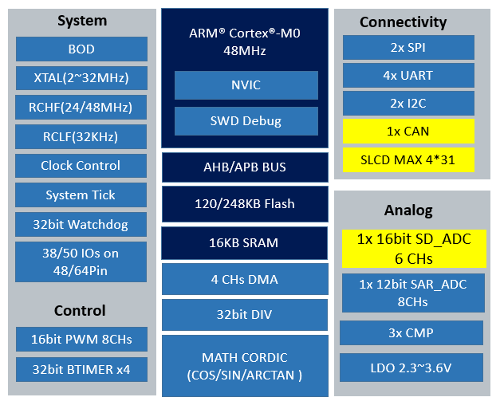

# [SWM181](https://www.soc.xin/SWM181)

* [Synwit](http://www.synwit.cn): [Cortex-M0](https://github.com/SoCXin/Cortex)
* [L1R2](https://github.com/SoCXin/Level): 48 MHz , [￥4.72](https://item.szlcsc.com/257391.html)

## [简介](https://github.com/SoCXin/SWM181/wiki)

[SWM181](https://www.synwit.cn/gaishu868/) 在基于SWM180出色的性能与高性价比高可靠性基础上进行了功能升级。在串口方面修改了UART，加入了校验位与停止位配置。MSB/LSB选择、自动、自动波特率矫正。同时降低了运行与睡眠功耗，增加了2.3V电压范围芯片上电时间不限，可以实现慢上电应用。可应用于工业控制、电机控制、 白色家电等多种领域。

支持片上包含精度为 1%以内的 24MHz、 48MHz 时钟，并提供最大为 248K字节的 FLASH 和最大 24K 字节的 SRAM。此外，芯片支持 ISP（在系统编程）操作及 IAP（在应用编程），用户可自定义BOOT程序。

### 关键参数

* 48 MHz Cortex-M0
* 16KB SRAM + 20-248 KB Flash
* 16位高精度SIGMA-DELTA ADC，前置7级可编程增益，最大32倍；
* SLCD：4*31
* 8个16位PWM
* 4个32位基本定时器
* 3个比较器
* I2C*2, SPI*2, UART*4, CAN*1
* 工作电压2.3V * 3.6V,多种省电工作模式
* 提供 QFN40/QFP48/QFP64 封装
* 工作温度范围（环境温度）-40℃ * 85℃

## [资源收录](https://github.com/SoCXin)

* [参考资源](src/)
* [参考文档](docs/)
* [参考工程](project/)

## [选型建议](https://github.com/SoCXin/SWM181)

[SWM181](https://item.szlcsc.com/257391.html)

## [www.SoC.xin](http://www.SoC.Xin)
